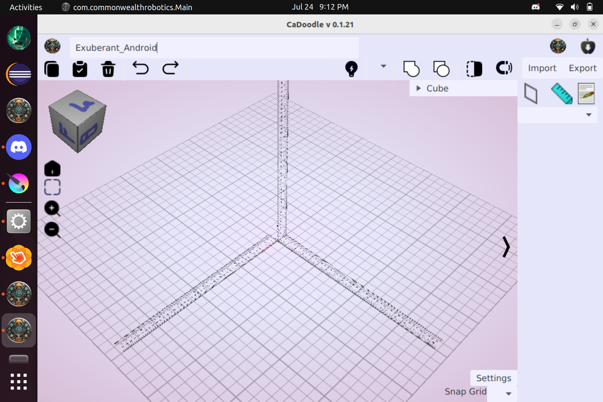
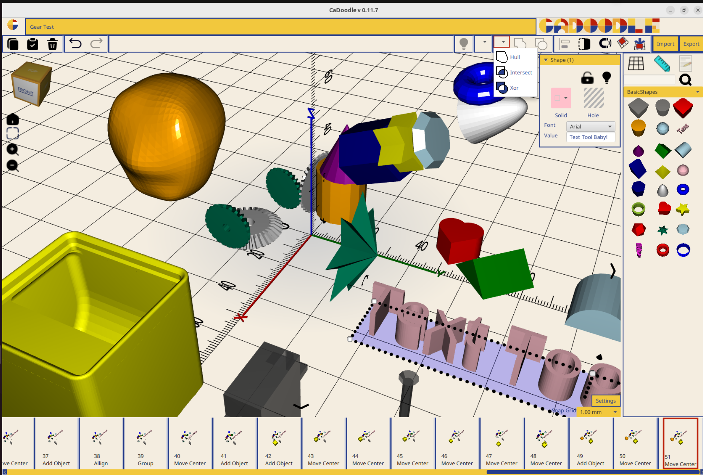

# About CaDoodle

## What is CaDoodle?

The description on the CaDoodle site is:

> A simple yet powerful CAD solution for designers and engineers 

CaDoodle is a drag-and-drop editor for 3D objects.

## Inspiration

CaDoodle is inspired by TinkerCAD. The workflow of TinkerCAD is an excellent experience for novice users of CAD: 

1. Drag and drop shape
1. Group and ungroup
1. Solid and Hole status
1. Undo of operations
1. Stretch and move handles
1. Library of examples
1. Nearest Surface snapping

However, this workflow suffers from a few fundamental problems:

1. Web based UI means it is enclosed by whomever runs the server
1. Subscription model is precarious (Autodesk is not known as a reliable partner for free tools over time)
1. Proprietary source files limit sharing, collaboration, and reproducability

## Solution 

This application is Java based and uses BowerStudio as the CAD kernel.

All scripts will be compatible BowlerStudio scripts. 

UI will be laid out in SceneBuilder / JavaFX.

OpenJDK 17 

## Hardware Requirements

* 4 GB of RAM is required

**The following platforms will be targeted:**

* Windows
* Mac OS (Arch 64)
* Linux Ubuntu (.deb and AppImage)
* ChromeOS
  
The following platforms will **not** be targeted:

* Android
* iOS

## Chrome OS Instructions

Linux is off by default. You can turn it on any time from Settings.

1.    On your Chromebook, at the bottom right, select the time.

2.    Select Settings and then About ChromeOS and then Developers.

3.    Next to "Linux development environment," select Set up.

4.    Follow the on-screen instructions. Setup can take 10 minutes or more.

5.    A terminal window opens. You have a Debian environment. You can run Linux commands, install more tools using the APT package manager, and customize your shell.

6. [Next download the ChromeOS .deb installer here](https://cadoodlecad.com/)

7. Finally, double-click on the .deb to install CaDoodle.

8. You can now launch CaDoodle from the applications launcher window.

## History

As an elementary school technology teacher, TinkerCAD provided easy to use on-ramps for students as young as 2nd grade. I spent the 23/24 school year teaching with TinkerCAD and found myself increasingly upset by the limitations and constraints of TinkerCAD. First and foremost, the fact of the CAD models sources being entirely unavailable. The "Tinkercad source" is actually entries in the Autodesk servers database. With no option to access those actual sources, students are tied entirely to the tinkercad website.

The first real problem came when a student made a model in 5th grade that was so complex that the Tinkercad site crashed. The model was not recoverable, and the student that had done all of that extra work to add detail to his model lost everything. This experience started me thinking about how this could be made better for the students.

The next major problem came when another student wanted to do CAD work on her ride home (which due to bus schedules took over an hour each day). She wanted to keep designing things, but without an internet connection she was unable to do any work.

Finally i began to contemplate the pedagogical damage being done by teaching students a skill that is only accessible to them as mediated by a company. I began to feel a deep sense of unease that the skills of my students were increasingly being trapped behind a paywall.

My solution was to make a locally installed application, that used an open file format that is stored locally on the disk, and that had access to the full resources of the computer the application was running on.

In July 2024 I began work in earnest on CaDoodle. 

In April 2025 I hit a level of feature completeness to open it up for Beta testing.  

