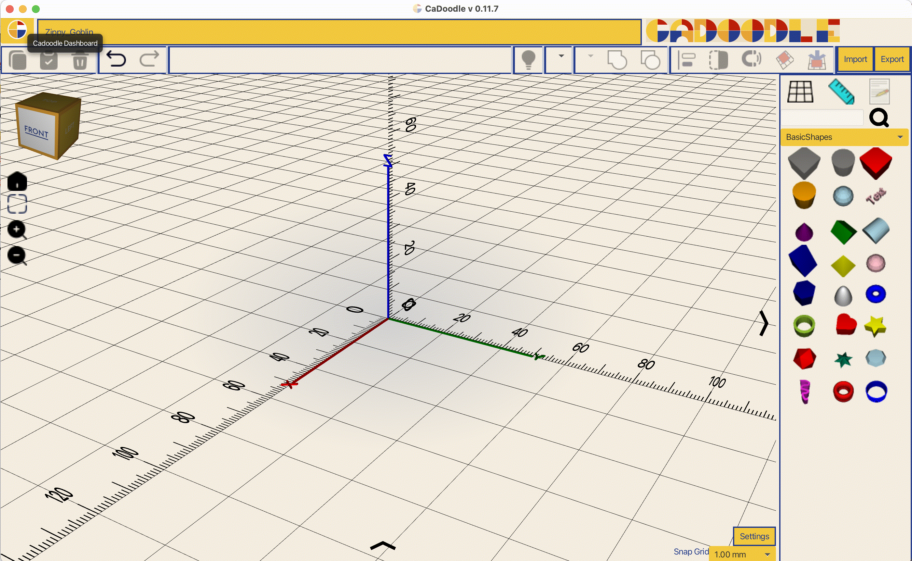
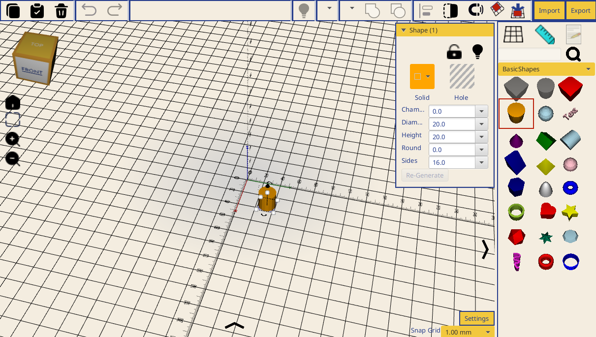

# Getting Started

## Overview

CaDoodle works with .doodle files. These files are stored on your local machine. They are created and accessed from the CaDoodle Dashboard.

## Creating your first shape

Each new .doodle file launches as a clear workspace with a shape panel on the right side. To add a shape to your workspace, click on the shape in the panel. 

Clicking on the shape will place the shape on the workspace and select the shape. A shape customization menu appears when shapes are selected. 

The shape customization menu allows you to make changes to basic shapes like adding chamfers, adjusting the number of sides, and more.

