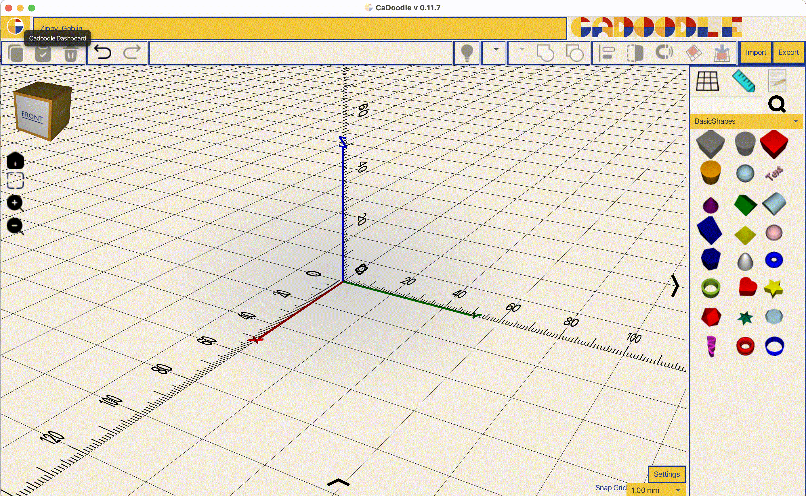
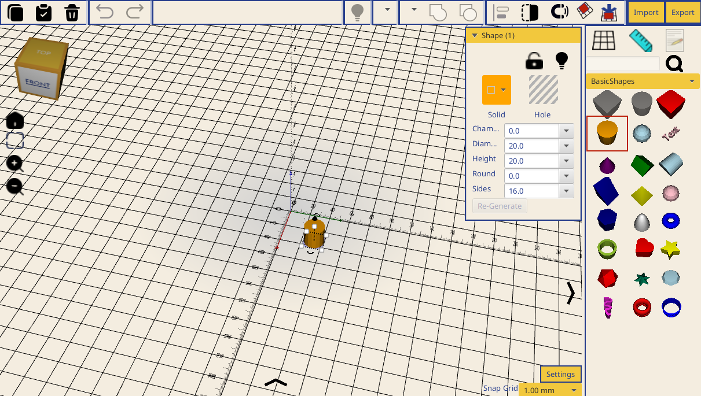
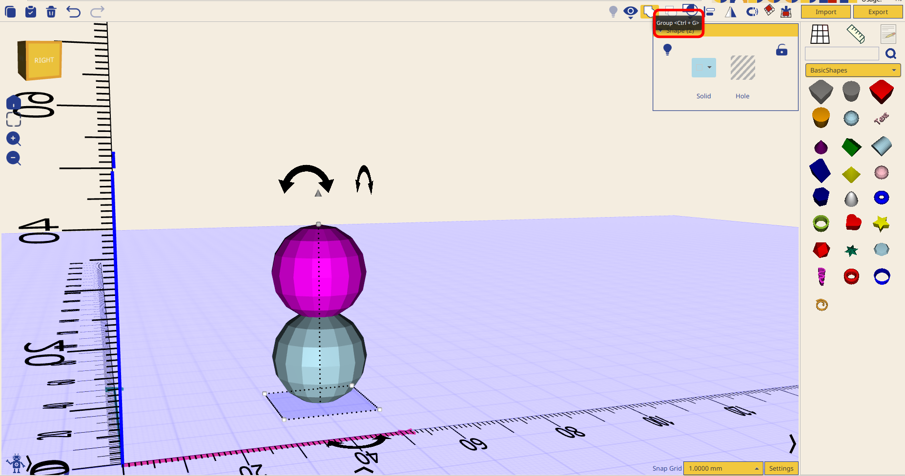
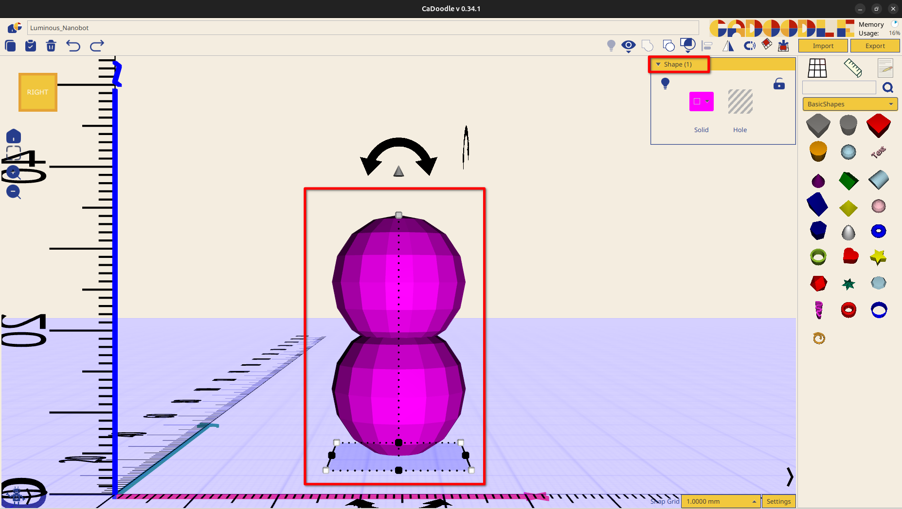

# Getting Started

## Overview

CaDoodle works with .doodle files. These files are stored on your local machine. They are created and accessed from the CaDoodle Dashboard.

## Creating your first shape

Each new .doodle file launches as a clear workspace with a shape panel on the right side. To add a shape to your workspace, click on the shape in the panel. 

Clicking on the shape will place it on the workspace and select it.

## Customizing shapes

When a shape is selected, a customization menu appears. The options available depend on the type of shape:

- **Chamfer / Fillet** — round off or bevel the edges of a shape
- **Number of sides** — change how many sides a cylinder or polygon has (e.g., turn a cylinder into a hexagon)
- **Dimensions** — set exact width, height, and depth values

Experiment with these options to see how they change your shape. You can always undo a change if the result isn't what you expected.

## Grouping and ungrouping

Grouping combines multiple shapes into a single object. This is how you build complex models from simple parts.

1. Select the shapes you want to combine
2. Click the **Group** button

Once grouped, the shapes move and resize together as one object.

To edit individual shapes again, select the group and click **Ungroup**.
